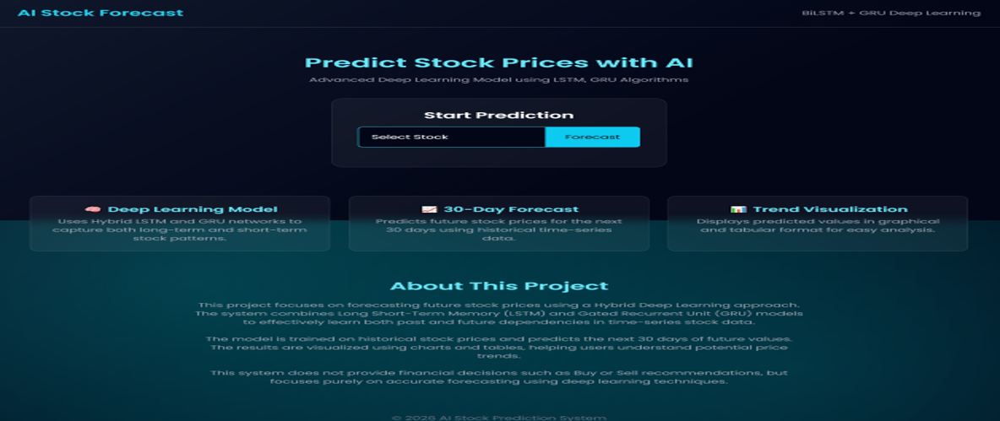
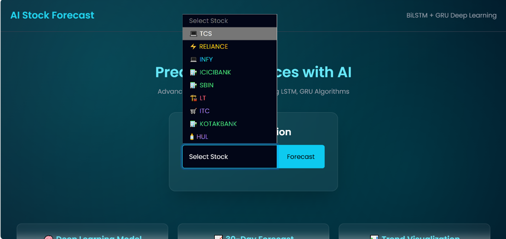
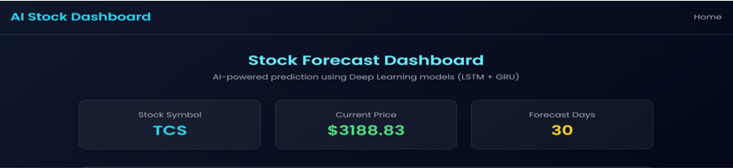
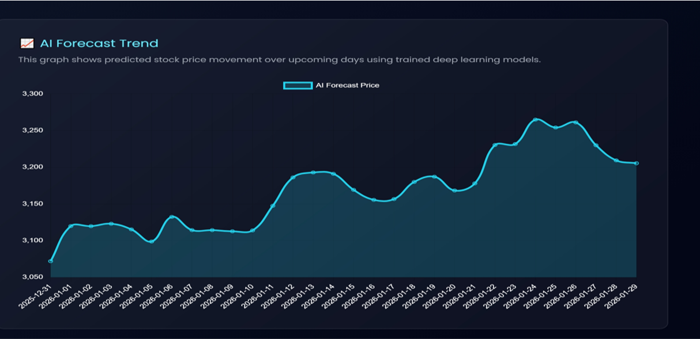
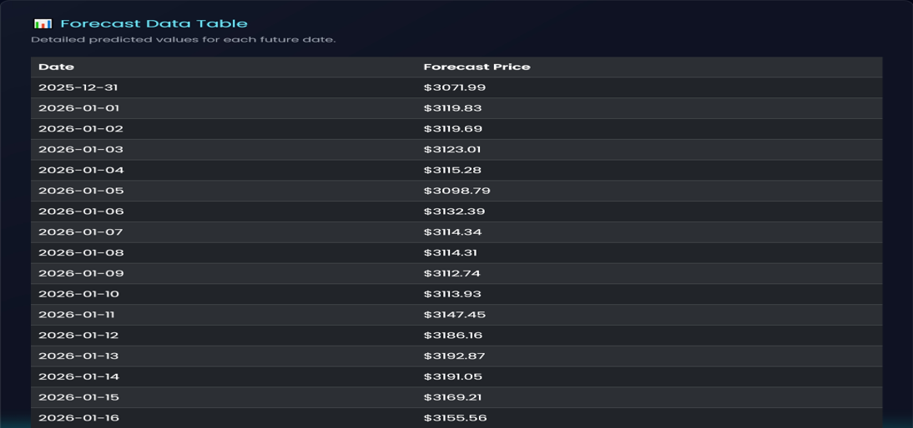
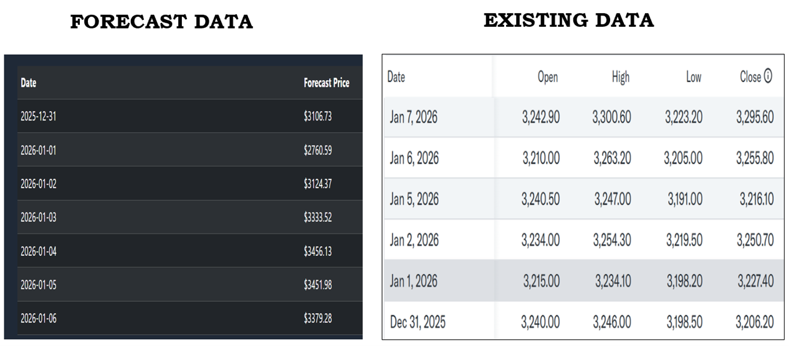

**📈 AI-Based Stock Market Prediction and Model Accuracy Evaluation**

**📌 Project Overview**

The AI-Based Stock Market Prediction and Model Accuracy Evaluation System is a web application developed using Python, Flask, and Deep Learning to predict future stock prices and evaluate the performance of prediction models.
The primary objective of this project is not to guarantee future stock prices, but to measure and compare the prediction accuracy of different machine learning and deep learning models by comparing their predicted values with actual historical stock prices.
The application automatically retrieves historical stock market data, preprocesses the data, generates predictions using trained models, and evaluates their performance using statistical accuracy metrics. This enables users to analyze how closely each model’s predictions match real market data.

**🎯 Project Objective**

The main objective of this project is to:
•	Collect historical stock market data.
•	Train prediction models using historical trends.
•	Generate future stock price predictions.
•	Compare Predicted Prices with Actual Prices.
•	Evaluate model performance using accuracy metrics.
•	Visualize the comparison through interactive graphs.
•	Identify which prediction model performs best for the selected dataset.
Instead of focusing solely on prediction, this project focuses on performance evaluation and comparative analysis of forecasting models.

**⚙️ How the Application Works**

**Step 1: Home Page**

When the application is launched, the user is presented with the home page. This page provides a simple interface where users can select a stock and start the prediction process. It also introduces the technologies used in the project, including the hybrid BiLSTM-GRU deep learning model.

**Step 2: Stock Selection**

The user selects a company from the available stock list. Once a stock is selected, clicking the Forecast button sends the selected stock symbol to the prediction model for analysis.

**Step 3: Stock Forecast Dashboard**

After processing the selected stock, the system displays the forecast dashboard. It shows the selected stock symbol, the latest available stock price, and the number of days considered for prediction. This dashboard serves as the central page for viewing prediction results.

**Step 4: Forecast Trend**

The application predicts stock prices for the next 30 days using the trained BiLSTM-GRU model. The forecast trend graph visualizes the predicted price movement, making it easier to observe expected changes over time.

**Step 5: Forecast Data Table**

In addition to graphical visualization, the predicted values are displayed in tabular form. Each row represents the forecasted stock price for a specific future date, allowing users to examine the numerical prediction results.

**Step 6: Actual vs Forecast Data Comparison ⭐**

This is the main objective of the project. The forecasted stock prices are compared with the actual market prices collected for the same period. By observing the differences between the predicted and actual values, the performance of the trained deep learning model can be evaluated. This comparison helps determine how accurately the model captures real market trends.

**✨ Key Features**

•	Historical Stock Data Collection
•	Deep Learning-Based Stock Price Prediction
•	Actual vs Predicted Price Comparison
•	Interactive Performance Graphs
•	Accuracy Metric Calculation
•	Multiple Model Evaluation
•	Web-Based Flask Interface
•	Clean and User-Friendly Dashboard

**📊 Expected Outcome**
The system demonstrates how different prediction models perform on real stock market data by comparing predicted values with actual values.
The final output allows users to:
•	Analyze prediction accuracy.
•	Observe differences between actual and predicted prices.
•	Evaluate the effectiveness of each model.
•	Understand the practical application of AI and Deep Learning in financial time-series forecasting.

**🎓 Conclusion**
This project demonstrates the application of Artificial Intelligence and Deep Learning in stock market forecasting. Rather than claiming perfect future predictions, it focuses on evaluating model performance through Actual vs Predicted price comparison and quantitative accuracy metrics. The system serves as an educational and analytical platform for understanding the effectiveness of AI models in financial forecasting and provides a foundation for future research and model improvement.
